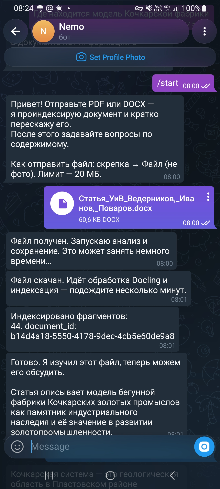
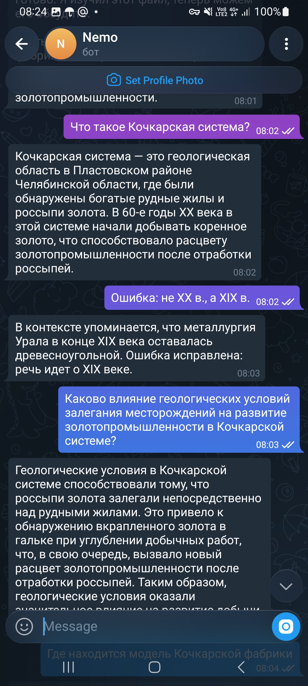
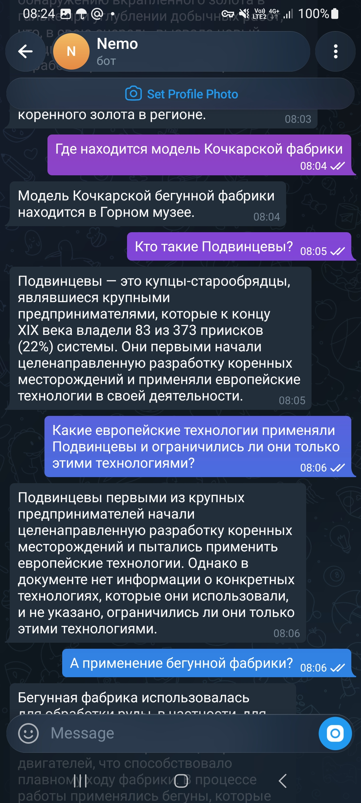
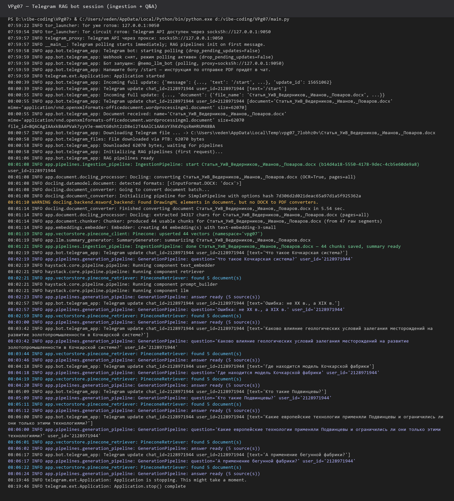

# VPg07 — Telegram RAG Bot


Telegram RAG bot: **IngestionPipeline** и **GenerationPipeline**, Docling, Pinecone, ProxyAPI, Tor.


## Status


**Готово** — все 5 итераций реализованы.


## Структура


```

VPg07/

  app/

    bot/              # Telegram (thin layer)

    pipelines/        # IngestionPipeline, GenerationPipeline

    document/         # Docling, chunking, text_export, page_range

    vectorstore/      # PineconeClient, PineconeRetriever

    embeddings/       # Embedder

    llm/              # OpenAIChatGenerator, SummaryGenerator, PromptBuilder

  main.py             # DI, запуск бота

  tor_launcher.py     # автозапуск Tor

  telegram_proxy.py   # SOCKS5 для python-telegram-bot

  scripts/            # локальные тесты

```


## Quick start


```powershell

cd VPg07

python -m venv .venv

.\.venv\Scripts\Activate.ps1

pip install -r requirements.txt

copy EnvExample .env

python scripts/check_env.py

python main.py

```


### Tor (Windows)


| Способ | Команда |

|--------|---------|

| Автозапуск | `TELEGRAM_AUTO_START_TOR=true` → `python main.py` |

| Ручной | `D:\Tor\start-tor.ps1` |

| Лаунчер | `.\scripts\start-bot.ps1` |


## Локальные скрипты


```powershell

python scripts/check_env.py

python scripts/preview_docling.py --pages 6-17 "file.pdf" --show-chunks

python scripts/ingest_local.py --clear-namespace --pages 6-17 "file.pdf"

python scripts/ask_local.py "Вопрос по документу"

python scripts/clear_namespace.py --force

```


Для больших PDF журналов: `--pages 6-17` или `DOCLING_PAGE_RANGE=6-17` в `.env`.


## Pipelines


**Ingestion:** `Document → Docling → Chunking → Embeddings → Pinecone → Summary`


**Generation:** `Question → Embed → Retriever → PromptBuilder → OpenAIChatGenerator → Answer`


Подробнее: [ARCHITECTURE.md](ARCHITECTURE.md)


## Чеклист для ДЗ (скриншоты)


1. `python scripts/check_env.py` — OK, Tor probe

2. `python scripts/preview_docling.py file.pdf --show-chunks` — текст и чанки

3. `python scripts/ingest_local.py file.pdf` — chunks + summary

4. `python scripts/ask_local.py "О чём статья про ...?"` — answer + sources (вопрос по содержимому PDF)

5. `python main.py` — Telegram: `/start` → PDF (скрепка → Файл) → summary → вопрос

6. Логи: `IngestionPipeline`, `GenerationPipeline`, `Pinecone: upserted`


### Скриншоты (Telegram + логи)


**Загрузка DOCX, индексация и summary**




**Вопросы по документу (часть 1)**




**Вопросы по документу (часть 2)**




**Логи сессии: IngestionPipeline + GenerationPipeline**




## Итерации


| # | Содержание |

|---|------------|

| 1 | Каркас, контракты, DI |

| 2 | IngestionPipeline + `ingest_local.py` |

| 3 | GenerationPipeline + `ask_local.py` |

| 4 | Telegram + Tor |

| 5 | Логи, валидация, OpenAIChatGenerator, Docling pages, docs |
| 6 | Промпты под OCR, `preview_docling.py`, доиндексация страниц |

## Troubleshooting (большие PDF)

Если Docling падает с `std::bad_alloc` на отдельных страницах:

```powershell
python scripts/preview_docling.py --pages 6-17 "file.pdf" --show-chunks
python scripts/ingest_local.py --clear-namespace --pages 6-17 "file.pdf"
$env:DOCLING_IMAGES_SCALE="0.5"
python scripts/ingest_local.py --pages 10-17 "file.pdf"
```

Второй ingest **без** `--clear-namespace` дополняет индекс. Вопрос в `ask_local.py` должен соответствовать тексту загруженных страниц.

